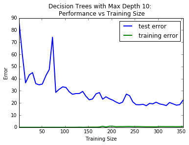
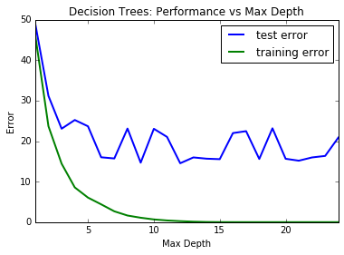
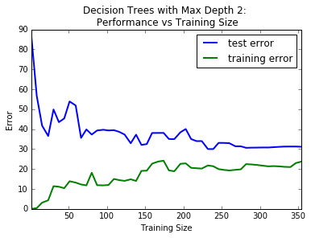

# Predicting Boston Housing Prices
## Model Evaluation & Validation Project
#### Machine Learning Engineer Nanodegree (Udacity)
Project submission by Edward Minnett (ed@methodic.io).

February 5th 2016.

## A Brief Introduction

The purpose of this project is to explore the 'Hedonic
prices and the demand for clean air' Boston house price data of D. Harrison and D.L. Rubinfeld (from the StatLib library which is maintained at Carnegie Mellon University). More specifically, this project attempts to apply Grid Search parameter optimisation to a Decision Tree Regressor that is in itself applied to the 13 feature data set. The features are described below. It is worth noting that the data set includes a 14th feature that will act as the target value of the regressor. It is also worth noting that these target values represent the median value of owner-occupied homes in $1000's. This suggests that each record is a summary of multiple houses and do not represent individual houses.

Features (in order):
+ **CRIM**     per capita crime rate by town
+ **ZN**       proportion of residential land zoned for lots over 25,000 sq.ft.
+ **INDUS**    proportion of non-retail business acres per town
+ **CHAS**     Charles River dummy variable (= 1 if tract bounds river; 0 otherwise)
+ **NOX**      nitric oxides concentration (parts per 10 million)
+ **RM**       average number of rooms per dwelling
+ **AGE**      proportion of owner-occupied units built prior to 1940
+ **DIS**      weighted distances to five Boston employment centres
+ **RAD**      index of accessibility to radial highways
+ **TAX**      full-value property-tax rate per $10,000
+ **PTRATIO**  pupil-teacher ratio by town
+ **B**        1000(Bk - 0.63)^2 where Bk is the proportion of blacks by town
+ **LSTAT**    % lower status of the population

And the target value:
+ **MEDV**     Median value of owner-occupied homes in $1000's

## Statistical Analysis and Data Exploration

To begin with, it is worth documenting a brief statistical analysis and exploration of the dataset in an attempt to better understand what it entails.

+ Size of data (number of records)? **506**
+ Number of features? **13**
+ Minimum price (in $1000's)? **5.0**
+ Maximum price (in $1000's)? **50.0**
+ Calculate mean price (in $1000's)? **22.533**
+ Calculate median price (in $1000's)? **21.2**
+ Calculate standard deviation (in $1000's)? **9.1880**

___

*This plot illustrates the distribution of median house values (MEDV) with the distribution median and mean values laid over the histogram.*
___

## Evaluating Model Performance

Of the available measures of model performance some are best suited for classification while others are better suited for regression analysis. Given this project involves training a Decision Tree Regressor, it makes the most sense to only consider the measures of model performance that are considered to be regression performance metrics. The following measures of regression model performance are included in the metrics package of the SciKit Learn Python library.

+ **explained_variance_score** Explained variance regression score function
+ **mean_absolute_error**	Mean absolute error regression loss
+ **mean_squared_error**	Mean squared error regression loss
+ **median_absolute_error**	Median absolute error regression loss
+ **r2_score**	R^2 (coefficient of determination) regression score function.

Of these 5 the explained_variance_score and the r2_score present a normalised measure of performance making their interpretation more intuitive. The other measures present errors that are dependent on the nature of the data in question. If additional records are added to the data, these error values will increase without necessarily indicating that the performance of the regressor has increased. Instead it is more likely than not that the regressor performance will improve with additional data despite the error increasing. Of the two normalised measures of performance, the r2_score incorporates the sum of squared errors which has been shown to be an efficient measure of regression fitness as it penalises the regressor more when data is further away from model.

In order to ensure there is a way to empirically compare the error produced by two trained models, there must be a shared data set, the test set, that can be used to measure performance. The test set is created by splitting out a fraction of the original data set. In the case of this project, 30% of the data is set aside to test the efficacy of the trained models. If the data is not split and the entire data set is used to both train and test each model, the training error and test error will be identical making it impossible to determine the performance of one model compared to another. It is also worth indicating that the removal of the test set removes the negative feedback loop introduced by comparative model performance that helps minimise the likelihood of models overfitting the data.

As suggested above, the test set provides a way to compare the performance of multiple models. Grid search is one way to make the process of producing multiple models in order to optimise the parameters used to train those models easier. The grid search mechanism trains models using all combinations of the parameters it receives. This process ultimately allows the discovery of which parameter values either minimise the error or maximise the performance score (depending on the metric used).

A further technique to optimise a given model is to use cross validation data sets in order to compare the performance of intermediate stages of the training process. More specifically, k-fold cross validation can be used to average any anomolous patterns that can be introduced when only considering a single random sample. Within the context of the grid search process, cross validation  can be used to estimate the generalisation error of each trained model and thus provide a mechanism to determine which set of parameters from the grid results is the highest performing model.

As a result of these benefits, cross validation in conjunction with grid search is used in this project (through the use of the default 3-fold cross validation) when attempting to find the optimised parameters for the Boston house prices Decision Tree Regressor.

## Analysing Model Performance

Upon generating the learning curve graphs that depict the performance vs. training size for each maximum tree depth from 1 to 10, it is clear that the model with a maximum depth of 1 is far less successful than the model with a maximum depth of 10. This suggests a general trend of increased performance as the maximum depth increases over that range. The graph representing a maximum depth of 1 shows both the test error and training error converging around 0.4 (suggesting the model has a high bias and is underfit) while the graph for a maximum depth of 10 does illustrate the training of a far more successful model where the test error shows a trend around 0.8. That said the training error for the latter hardly deviates from 1.0. The gap between the training error and test error for that model suggests it has high variance and has overfit the training data.

All 10 learning curve graphs along with the model complexity graph can be found in the appendix at the end of this document. The graphs for maximum depths 1 and 10 along with the model complexity graph have been added inline to better illustrate the analysis.

___

*Decision Tree Performance vs Training Size with a maximum depth of 1.*
___

*Decision Tree Performance vs Training Size with a maximum depth of 10.*
___

By plotting the model performance vs max depth, it becomes clear that training error improves until it reaches the maximum value of 1.0 while the test error peaks and plateaus at a lower value (between 0.75 and 0.8). This suggests the interpretation that the models with greater complexity are indeed overfitting and exhibiting high variance. Based on the shape of the test error in the model complexity plot, it appears that the Decision Tree Regressor with a maximum depth of 4 best generalises the data given that it is at this level of model complexity that the test error is minimised (maximised performance) while minimising the model complexity itself.

___

*Decision Tree Performance compared to the model complexity.*
___

It is worth noting that there is a considerable amount of noise displayed in these graphs. It is the author's belief that this is the result of the data set being too small. If the data set were larger, the noise introduced by random sampling when splitting training and test data would have less of an impact on the signal that should indicate which maximum depth parameter best generalises the data.

## Model Prediction

As noted above, the small data set results in noise caused by the random sampling when splitting the training and test data. This noise prevents the grid search algorithm from converging upon an optimal parameter for the maximum depth of the Decision Tree Regressor. The initial investigation did not display a pattern in the resulting fit model score and prediction beyond the fact that the variability in the results appeared to be discreet in nature. This is no surprise given the discreet nature of the small number of parameters that the Grid Search is optimising. To explore the variability in results further, it felt prudent to take a sample of the results and analyse this sample further. An initial sample of 100 results illustrated the distribution is not uniform. The sample size was increased to 1000 to better understand the nature of this distribution. The Grid Search for this project consistently generates 7 different results reflected in the distribution discussed below.

The prediction for each model is the predicted median value of owner-occupied homes in $1000's (MEDV) for given the following parameters:
+ **CRIM**:     11.95  - per capita crime rate by town
+ **ZN**:       0.00   - proportion of residential land zoned for lots over 25,000 sq.ft.
+ **INDUS**:    18.100 - proportion of non-retail business acres per town
+ **CHAS**:     0      - Charles River dummy variable (= 1 if tract bounds river; 0 otherwise)
+ **NOX**:      0.6590 - nitric oxides concentration (parts per 10 million)
+ **RM**:       5.6090 - average number of rooms per dwelling
+ **AGE**:      90.00  - proportion of owner-occupied units built prior to 1940
+ **DIS**:      1.385  - weighted distances to five Boston employment centres
+ **RAD**:      24     - index of accessibility to radial highways
+ **TAX**:      680.0  - full-value property-tax rate per $10,000
+ **PTRATIO**:  20.20  - pupil-teacher ratio by town
+ **B**:        332.09 - 1000(Bk - 0.63)^2 where Bk is the proportion of blacks by town
+ **LSTAT**:    12.13  - % lower status of the population

The Mean Score in the table below is the mean of all the score values given by the Grid Search grouped by maximum depth.

___
Results ordered by frequency (from a sample of 1000 results):

| Frequency | Maximum Depth | Mean Score | Prediction in $1000's (MEDV) |
| --------- | ------------- | ---------- | ---------------------------- |
| 435       | 4             | 0.4480     | 21.6297                      |
| 183       | 6             | 0.4370     | 20.7660                      |
| 119       | 7             | 0.4293     | 19.9975                      |
| 111       | 5             | 0.4236     | 20.9678                      |
| 60        | 8             | 0.4147     | 18.8167                      |
| 51        | 9             | 0.4114     | 19.3273                      |
| 41        | 10            | 0.4096     | 20.7200                      |

**NB** *Even though the table is inversely ordered by frequency, it is also inversely ordered by the Mean Scores. These columns have a Pearson product-moment correlation coefficient of 0.9156 suggesting a very high degree of correlation.*
___

In rough terms, this distribution suggests that, the Grid Search found a maximum depth of 4 twice as often as 6 which was in turn found twice as often as either 5 or 7 which were each in turn found twice as often as either 8, 9 or 10. From these results it is clear that the Decision Tree Regressor with a maximum depth of 4 is the optimal model (among the parameters applied to Grid Search).

The prediction for the median value of owner-occupied homes in $1000's (MEDV) given by this model is 21.6297. This prediction is well within the distribution of the MEDV values shown in the statistical analysis of the Boston housing data set. In fact this prediction lies between the median and mean of the MEDV values which suggests, assuming the model is accurate, that the test prediction parameters are indicative of the mean of each distribution parameters. Naturally these values are easy to calculate. The test prediction parameters are not exactly the mean of each distribution, but are close enough to believe that the predicted MEDV value is valid and in turn that trained model is valid.

## Appendix

___

*Decision Tree Performance vs Training Size with a maximum depth of 1.*
___

*Decision Tree Performance vs Training Size with a maximum depth of 2.*
___

*Decision Tree Performance vs Training Size with a maximum depth of 3.*
___

*Decision Tree Performance vs Training Size with a maximum depth of 4.*
___

*Decision Tree Performance vs Training Size with a maximum depth of 5.*
___

*Decision Tree Performance vs Training Size with a maximum depth of 6.*
___

*Decision Tree Performance vs Training Size with a maximum depth of 7.*
___

*Decision Tree Performance vs Training Size with a maximum depth of 8.*
___

*Decision Tree Performance vs Training Size with a maximum depth of 9.*
___

*Decision Tree Performance vs Training Size with a maximum depth of 10.*
___

*Decision Tree Performance compared to the model complexity.*
___
