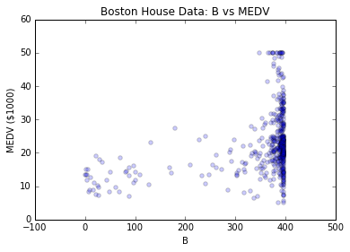
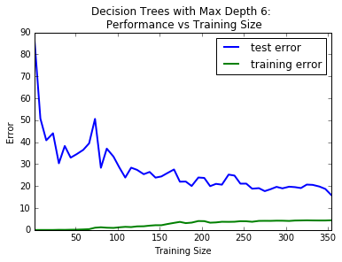

# Predicting Boston Housing Prices
## Model Evaluation & Validation Project
#### Machine Learning Engineer Nanodegree (Udacity)
Project submission by Edward Minnett (ed@methodic.io).

March 12th 2016. (Revision 3)

## A Brief Introduction

The purpose of this project is to explore the 'Hedonic prices and the demand for clean air' Boston house price data of D. Harrison and D.L. Rubinfeld (from the StatLib library which is maintained at Carnegie Mellon University). More specifically, this project attempts to apply Grid Search hyperparameter optimisation to a Decision Tree Regressor that is in itself applied to the 13 feature data set. The features are described below. The data set includes a 14th feature that will act as the target value of the regressor. It is also worth noting that these target values represent the median value of owner-occupied homes in $1000's. This suggests that each record is a summary of multiple houses and do not represent individual houses.

Features (in order):
+ **CRIM**     per capita crime rate by town
+ **ZN**       proportion of residential land zoned for lots over 25,000 sq.ft.
+ **INDUS**    proportion of non-retail business acres per town
+ **CHAS**     Charles River dummy variable (= 1 if tract bounds river; 0 otherwise)
+ **NOX**      nitric oxides concentration (parts per 10 million)
+ **RM**       average number of rooms per dwelling
+ **AGE**      proportion of owner-occupied units built prior to 1940
+ **DIS**      weighted distances to five Boston employment centres
+ **RAD**      index of accessibility to radial highways
+ **TAX**      full-value property-tax rate per $10,000
+ **PTRATIO**  pupil-teacher ratio by town
+ **B**        1000(Bk - 0.63)^2 where Bk is the proportion of blacks by town
+ **LSTAT**    % lower status of the population

And the target value:
+ **MEDV**     Median value of owner-occupied homes in $1000's

## Statistical Analysis and Data Exploration

To begin with, we will document a brief statistical analysis and exploration of the dataset in an attempt to better understand what it entails.

+ Size of data (number of records)? **506**
+ Number of features? **13**
+ Minimum price (in $1000's)? **5.0**
+ Maximum price (in $1000's)? **50.0**
+ Calculate mean price (in $1000's)? **22.533**
+ Calculate median price (in $1000's)? **21.2**
+ Calculate standard deviation (in $1000's)? **9.1880**

___

*This plot illustrates the distribution of median house values (MEDV) with the distribution median and mean values laid over the histogram.*
___

In order to attain a better understanding of the shape of this data set it felt pertinent to produce a scatter plot for each of the thirteen features against the target. All thirteen plots can be found in Appendix A. Not all of the plots suggest a linear relationship between the feature and the target. This will be particularly important when considering and justifying which model performance metrics may be appropriate or not. The two plots below are particularly good examples of nonlinear relationships between the features and target.

___

*The plot of CHAS vs MEDV clearly shows that the Charles River dummy variable is categorical and not linear.*
___

*The plot of LSTAT vs MEDV shows that a linear model would fit the % lower status feature quite badly.*
___

## Evaluating Model Performance

Of the available measures of model performance some are best suited for classification while others are better suited for regression analysis. Given this project involves training a Decision Tree Regressor, it makes the most sense to only consider the measures of model performance that are considered to be regression performance metrics. The following measures of regression model performance are included in the metrics package of the SciKit Learn Python library.

+ **explained_variance_score** Explained variance regression score function
+ **r2_score**	R^2 (coefficient of determination) regression score function
+ **median_absolute_error**	Median absolute error regression loss
+ **mean_absolute_error**	Mean absolute error regression loss
+ **mean_squared_error**	Mean squared error regression loss

Of these 5, the Explained Variance Score and the R2 Score present a normalised measure of performance where a perfect performance (no error) model scores 1 on a scale of 0 to 1. On the other hand, the Median Absolute Error (MedAE), Mean Absolute Error (MAE), and Mean Squared Error (MSE) metrics of a model indicate actual error values (non normalised) rather than model performance. Ultimately tuning a model with either of the normalised performance metrics is a matter of maximising the result while tuning using any of the error metrics requires minimising the error metric. Ultimately, this project is set up in such a way that the model performance is measured as an error rather than a performance score. As a result, we will only consider the efficacy of MedAE, MAE and MSE. Even if we were to consider using one of the performance scores rather than an error function, the R2 score still would not be an appropriate choice. It is an inadequate measure of the goodness of fit for nonlinear models and as we saw in the previous section, not all the features in this data set exhibit linear relationships with the target [1].

MedAE ignores the impact of outliers while both MAE and MSE will increase in presence of outlier data. The distribution of the median house prices from the section above shows two peaks where the second peak represents the most expensive houses. MedAE would ignore the impact of the error introduced by this second peak. Because of this, the MedAE would be a poor choice as an error metric. The main difference between MAE and MSE is how the error metric penalises the distance a datum is from the model. If datum A is twice as far from the model as datum B, MAE will consider the error of A to be twice as high as that of B. Instead of treating error in a linear fashion, MSE squares the distance. In this toy model, MSE would consider the error of A to be 4 times greater than that of B. This property of MSE ensures that there will be a global minimum of the fitness function ensuring convergence to the optimal solution when comparing regression models. For this reason, the author has chosen to use MSE as the regression performance metric for this project.

In order to ensure there is a way to empirically compare the error produced by two trained models, there must be a shared data set, the test set, that can be used to measure performance. The test set is created by splitting out a fraction of the original data set. In the case of this project, 30% of the data is set aside to test the efficacy of the trained models. If the data is not split and the entire data set is used to both train and test each model, the training error and test error will be identical. This would make it much harder to determine the performance of one model compared to another.

As suggested above, the test set provides a way to compare the performance of multiple models. Grid search is one implementation of Hyperparameter Optimisation, an approached used to find the model that best fits the given data within the constraints of the parameters supplied to the algorithm. The grid search algorithm trains models using all combinations of the parameters it receives. This process ultimately allows the discovery of which parameter values either minimise the error or maximise the performance score (depending on the metric used). For this project, we are using MSE as a measure of error in which case Grid Search will attempt to minimise MSE across all of combinations of parameters.

Unless a negative feedback loop is introduced in the learning process, a model will attempt to overfit the data it is given. Even though testing the model against the test data set is a way of determining whether a model is overfit, it is not adequate to prevent overfitting in the first place. One way to introduce this feedback loop is to use cross-validation. Cross-validation allows the process of training a model to predict how well that model may generalise over new data without having to expose it to that data. This is performed by taking a fraction of the training data and reserving it as the cross-validation data. The score or error that results from testing the model against the cross-validation data set can then be fed back into the training process in an attempt to overcome overfitting. When the process of cross-validation tests are repeated, the subsequent results can be averaged or somehow combined to improve the generalisation of the model. The exact method of combining the cross-validation results should be informed by the metric used to score the model, the parameters that being for as well as nature of the problem the model is attempting describe. There are two types of cross-validation, exhaustive and non-exhaustive. Exhaustive cross-validation tests the model against all combinations of splitting the training set into training and cross-validation sets. Although this may be ideal as it will avoid any potential noise that may appear as a result of how the data happens to be sampled, it is a very costly process. By comparison, non-exhaustive cross-validation allows for the same feedback loop without the excessively large number of iterations required to perform exhaustive cross-validation. One approach to non-exhasutive cross-validation is to use k-fold cross-validation. K-fold cross-validation splits the training data set into k subsets setting aside one for cross-validation while using the remaining k-1 subsets to train the model. The training and cross-validation process is repeated until all k subsets have been used as the cross-validation data set. The results are then averaged or combined to produce a single model that should not exhibit the symptoms of high variance.

As a result of these benefits, cross-validation in conjunction with grid search is used in this project when attempting to find the optimised parameters for the Boston house prices Decision Tree Regressor (through the use of the default 3-fold cross-validation provided by SkLearn's implementation of Grid Search).

[1]: Spiess, Andrej-Nikolai, Natalie Neumeyer. An evaluation of R2 as an inadequate measure for nonlinear models in pharmacological and biochemical research: a Monte Carlo approach. BMC Pharmacology. 2010; 10: 6.

## Analysing Model Performance

In order to analyse the model performance and get a sense as to whether a given model is displaying high bias (has underfit the training data) or is displaying high variance (has overfit the training data) we need to examine how the model performs against both the training data and the test data. More specifically, we are interested in how the model performance against the training and test data sets change as we increase the training size for a given model. We expect that as the training size increases for a given model the training error will increase and the test error will decrease. The exact shape of these curves, the gap between them as they begin to converge and whether or not the training error does decrease for a given model will help indicate whether the model in question is displaying high bias, high variance, or neither.  

We will also explore how the model performance changes as we increase the model complexity. Ideally the test error curve for the performance versus model complexity will be convex. In this situation, it is possible to infer the ideal model complexity by finding the global minimum of the test error curve.

To begin with, we generated the learning curves that depict the model performance versus training size for each value of the maximum tree depth parameter from 1 to 10 (all 10 plots can be found in Appendix B). It is immediately clear that the model with a maximum depth of 1 is far less successful than the model with a maximum depth of 10. This suggests a general trend of increased performance as the maximum depth increases over that range. The plot representing a maximum depth of 1 shows both the test error and training error converging to an error a little below 50. The fact that the learning curve illustrates such poor performance for the fit against the training data suggests that the model has underfit the data. By comparison, the test error curve for the model with a maximum depth of 10 begins to converge near an error of 20 suggesting a significant improvement over the model with a maximum depth of 10. That said the training error for the model with maximum depth of 10 hardly increases above 0 suggesting it has high variance and has overfit the training data.

There is great variability in the learning curve plots from one iteration of the code to another. In an attempt to explore why this might be, the author of this project found that one drawback to using CART (classification and regression tree) models is that the greedy nature of their construction causes them to be unstable. Small changes to their input data can result in wide variations in the construction of the trees [2]. This instability made it very difficult to make general inferences from the generated learning curves for a single iteration. In an attempt to remedy this, the author sampled the learning curve data over 100 iterations and produced learning curve plots that displayed all 100 sets of curves with the much smoother mean of those curves superimposed over the top. The learning curve plots for the maximum depths of 1 and 10 for both a single iteration as well as the collection of 100 iterations for comparison. These additional plots reinforce the interpretation outlined above; the plot with a maximum depth appear to have underfit the training data and exhibits high bias while the plot for the model with a maximum depth of 10 appears to have overfitthe training data and exhibits high variance. All 10 learning curve plots depicting the data for the 100 iterations can be found in Appendix C.

___

*Decision Tree Performance vs Training Size with a maximum depth of 1.*
___

*Decision Tree Performance vs Training Size with a maximum depth of 1 over 100 iterations along with the mean curves.*
___

*Decision Tree Performance vs Training Size with a maximum depth of 10.*
___

*Decision Tree Performance vs Training Size with a maximum depth of 10 over 100 iterations along with the mean curves.*
___

By plotting the model performance vs max depth, it becomes clear that training error improves until it reaches the minimum value of 0 while the test error peaks and plateaus at a higher error value though does not remain stable (between an error of 15 and 25). It is very difficult to interpret much from this plot with any confidence apart from the fact that a model with a maximum depth less than 5 or 7 is likely to perform worse than a model with greater complexity. As discussed above, the model complexity plot benefits from taking a sample of iterations and plotting the average of those iterations in an attempt to find a smoother curve. The mean performance versus model complexity curve for the test data does appear to be convex (although only slightly) displaying a minumum at a maximum depth value of 5. It is at this point where the test error is optimised while minimising the model complexity. That said, the degree by which the optimal value minimises the test error is so slight and the variability between individual model complexity plots is so great that it is hard to be confident that the model with a maximum depth of 5 is indeed optimal. Both model complexity plots are displayed below to aid comparison.

___

*Decision Tree Performance compared to the model complexity.*
___

*Decision Tree Performance compared to the model complexity over 100 iterations along with the mean curves.*
___

[2]: Murphy, Kevin P. "16.2.4 Pros and Cons of Trees." Machine Learning: A Probabilistic Perspective. Cambridge, MA: MIT, 2012. N. pag. Print.

## Model Prediction

As noted above, the inherent instability of CART models results a high degree of variability between iterations of model training and evaluation. Even though the grid search approach does converge upon a single optimal model for each given iteration, the optimal model is not always the some for subsequent iterations. The initial investigation did not display a pattern in which model was considered to be optimal beyond the fact that the variability in the results appeared to be discreet in nature. This is no surprise given the discreet nature of the small number of parameters that the Grid Search is optimising. To explore the variability in the results further, it felt prudent to take a sample of the results and analyse this sample further. An initial sample of 100 results illustrated the distribution is not uniform. The sample size was increased to 1000 to better understand the nature of this distribution. The Grid Search for this project using MSE as the performance metric consistently generates 7 different results. The sample of these results are  reflected in the distribution discussed below.

The prediction for each model is the predicted median value of owner-occupied homes in $1000's (MEDV) given the following parameters:
+ **CRIM**:     11.95  - per capita crime rate by town
+ **ZN**:       0.00   - proportion of residential land zoned for lots over 25,000 sq.ft.
+ **INDUS**:    18.100 - proportion of non-retail business acres per town
+ **CHAS**:     0      - Charles River dummy variable (= 1 if tract bounds river; 0 otherwise)
+ **NOX**:      0.6590 - nitric oxides concentration (parts per 10 million)
+ **RM**:       5.6090 - average number of rooms per dwelling
+ **AGE**:      90.00  - proportion of owner-occupied units built prior to 1940
+ **DIS**:      1.385  - weighted distances to five Boston employment centres
+ **RAD**:      24     - index of accessibility to radial highways
+ **TAX**:      680.0  - full-value property-tax rate per $10,000
+ **PTRATIO**:  20.20  - pupil-teacher ratio by town
+ **B**:        332.09 - 1000(Bk - 0.63)^2 where Bk is the proportion of blacks by town
+ **LSTAT**:    12.13  - % lower status of the population

The Mean Score in the table below is the mean of all the score values given by the Grid Search grouped by maximum depth.

___
Results ordered by Maximum Depth (from a sample of 1000 results):

| Frequency | Maximum Depth | Mean Score | Prediction in $1000's (MEDV) |
| --------- | ------------- | ---------- | ---------------------------- |
| 40        | 4             | -34.7937   | 21.6297                      |
| 229       | 5             | -32.6347   | 20.9678                      |
| 222       | 6             | -32.7927   | 20.7660                      |
| 139       | 7             | -32.8964   | 19.9975                      |
| 164       | 8             | -32.8084   | 18.8167                      |
| 108       | 9             | -33.0129   | 19.3273                      |
| 98        | 10            | -33.2868   | 20.7200                      |

**NB** *The Frequency and Mean Score columns have a Pearson product-moment correlation coefficient of 0.8198 suggesting a high degree of correlation.*
___

The above distribution has a median maximum depth value of 7 and mean of 6.874. These two statistics suggest that the model with a maximum depth of 7 is the best estimator of those evaluated by the grid search. The prediction for the median value of owner-occupied homes in $1000's (MEDV) given by this model is 19.9975. This prediction is well within the distribution of the MEDV values shown in the statistical analysis of the Boston housing data set. In fact this prediction lies just below the median and mean of the MEDV values which suggests, assuming the model is accurate, that the test prediction parameters may be close of the mean of each parameter distribution. Naturally these values are easy to calculate. The test prediction parameters are not exactly the mean of each distribution, but are close enough to believe that the predicted MEDV value is valid and in turn that the trained model is valid.

## Appendices

### Appendix A: Relationships Between Each Feature and the Target (MEDV)
___

*The plot of CRIM (per capita crime rate by town) vs MEDV (Median value of owner-occupied homes in $1000's).*
___

*The plot of ZN (proportion of residential land zoned for lots over 25,000 sq.ft.) vs MEDV (Median value of owner-occupied homes in $1000's).*
___

*The plot of INDUS (proportion of non-retail business acres per town) vs MEDV (Median value of owner-occupied homes in $1000's).*
___

*The plot of CHAS (Charles River dummy variable (= 1 if tract bounds river; 0 otherwise)) vs MEDV (Median value of owner-occupied homes in $1000's).*
___

*The plot of NOX (nitric oxides concentration (parts per 10 million)) vs MEDV (Median value of owner-occupied homes in $1000's).*
___

*The plot of RM (average number of rooms per dwelling) vs MEDV (Median value of owner-occupied homes in $1000's).*
___

*The plot of AGE (proportion of owner-occupied units built prior to 1940) vs MEDV (Median value of owner-occupied homes in $1000's).*
___

*The plot of DIS (weighted distances to five Boston employment centres) vs MEDV (Median value of owner-occupied homes in $1000's).*
___

*The plot of RAD (index of accessibility to radial highways) vs MEDV (Median value of owner-occupied homes in $1000's).*
___

*The plot of TAX (full-value property-tax rate per $10,000) vs MEDV (Median value of owner-occupied homes in $1000's).*
___

*The plot of PTRATIO (pupil-teacher ratio by town) vs MEDV (Median value of owner-occupied homes in $1000's).*
___

*The plot of B (1000(Bk - 0.63)^2 where Bk is the proportion of blacks by town) vs MEDV (Median value of owner-occupied homes in $1000's).*
___

*The plot of LSTAT (% lower status of the population) vs MEDV (Median value of owner-occupied homes in $1000's).*
___

### Appendix B: Learning Curve and Model Complexity Graphs (single iteration)
___

*Decision Tree Performance vs Training Size with a maximum depth of 1.*
___

*Decision Tree Performance vs Training Size with a maximum depth of 2.*
___

*Decision Tree Performance vs Training Size with a maximum depth of 3.*
___

*Decision Tree Performance vs Training Size with a maximum depth of 4.*
___

*Decision Tree Performance vs Training Size with a maximum depth of 5.*
___

*Decision Tree Performance vs Training Size with a maximum depth of 6.*
___

*Decision Tree Performance vs Training Size with a maximum depth of 7.*
___

*Decision Tree Performance vs Training Size with a maximum depth of 8.*
___

*Decision Tree Performance vs Training Size with a maximum depth of 9.*
___

*Decision Tree Performance vs Training Size with a maximum depth of 10.*
___

*Decision Tree Performance compared to the model complexity.*
___

### Appendix C: Learning Curve and Model Complexity Graphs (100 iterations)
___

*Decision Tree Performance vs Training Size with a maximum depth of 1 over 100 iterations along with the mean curves.*
___

*Decision Tree Performance vs Training Size with a maximum depth of 2 over 100 iterations along with the mean curves.*
___

*Decision Tree Performance vs Training Size with a maximum depth of 3. over 100 iterations along with the mean curves*
___

*Decision Tree Performance vs Training Size with a maximum depth of 4 over 100 iterations along with the mean curves.*
___

*Decision Tree Performance vs Training Size with a maximum depth of 5 over 100 iterations along with the mean curves.*
___

*Decision Tree Performance vs Training Size with a maximum depth of 6 over 100 iterations along with the mean curves.*
___

*Decision Tree Performance vs Training Size with a maximum depth of 7 over 100 iterations along with the mean curves.*
___

*Decision Tree Performance vs Training Size with a maximum depth of 8 over 100 iterations along with the mean curves.*
___

*Decision Tree Performance vs Training Size with a maximum depth of 9 over 100 iterations along with the mean curves.*
___

*Decision Tree Performance vs Training Size with a maximum depth of 10 over 100 iterations along with the mean curves.*
___

*Decision Tree Performance compared to the model complexity over 100 iterations along with the mean curves.*
___
